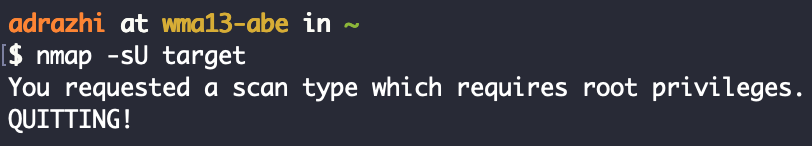
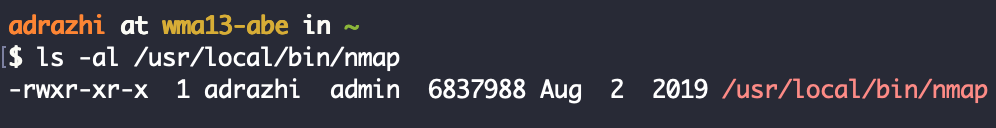
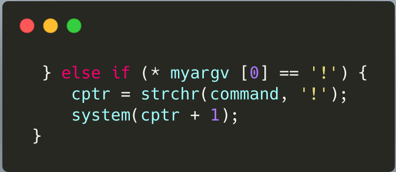
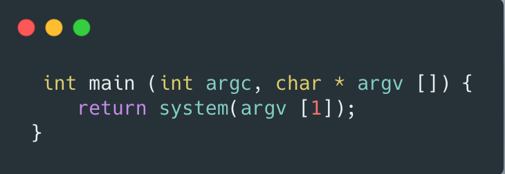
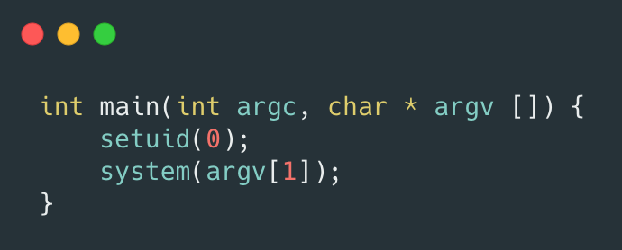

##  Intro
Generally speaking, Linux runs a program with the user rights currently running the program, which is of course reasonable. But there are some programs that are more special, such as our commonly used ping command. 

Ping needs to send `ICMP` messages, and this operation needs to send Raw Socket. Before the introduction of `CAPABILITIES` in `Linux 2.2`, using Raw Sockets required `root` permissions (of course, it is not to say that the introduction of `CAPABILITIES` does not require permissions, but can be solved by other methods, more on this later), so if you `ls -al $(which ping)` in some old systems `ls -al $(which ping)` , you can find that its permissions are `-rwsr-xr-x` , which has an `s` bit, this is `suid`:

```
adrazhi at wma13-abe in ~
$ ls -al $(which ping)
-r-xr-xr-x  1 root  wheel  55216 Jan 23 07:58 /sbin/ping
```

The full name of suid is Set owner U ser ID up on execution. This is a property that Linux gives to executable files. In the above case, the reason why ordinary users can also use the ping command is because we set the `suid` permission on the executable file.

When a program with the `s` bit set is running, its Effective `UID` will be set to the owner of the program. For example, the owner of the `/bin/ping` program is `0 (root)`, and it sets the `s` bit, so when an ordinary user runs ping, its Effective UID is 0, which is equivalent to having root permissions.

A new concept, Effective UID, is introduced here. Linux processes have three UIDs when running:

- **Real UID**: The actual UID of the user executing the process
- **Effective UID**: The UID that takes effect when the program actually operates (for example, when writing to a file, the system will check whether this UID has permissions)
- **Saved UID**: retains its original UID after a power-down user de-authorizes (this UID is not discussed in depth in this article)

Under normal circumstances, the Effective UID is equal to the Real UID, so ordinary users cannot write `/etc/passwd`, and can only be written with `UID = 0`; when a suid program starts, the Effective UID is equal to the owner of the binary file. The UID may not be equal to the Effective UID.

However, the statement that "as long as a program has suid permissions, it can elevate rights", is actually inaccurate. Only when the owner of this program is No. 0 or other super user and has suid permissions, can the privilege be elevated.

## So why can nmap do that then?
In nmap if you want to perform UDP or TCP SYN scanning, you need root permissions:



The reason is that these operations will use Raw Socket. 
Sometimes you have to use sudo to execute nmap, but when script calls nmap, 
sudo also needs tty, and it may be necessary to enter a password. This limitation will cause unnecessary trouble in many cases.

Therefore, some users add suid permissions to nmap, so that ordinary users can run nmap at will.

Of course, it is not safe to add `s-bit` nmap, we can use `nmap` to elevate power. Prior to `nmap 5.20`, there was an interactive mode. We can use this mode to escalate privileges:



After nmap 5.20 can execute custom commands by loading custom scripts:

Add one, `--interactive` should be an option provided by older versions of nmap. This option is not available in recent nmap, but you can write an os.execute('/bin/sh') script with the content os.execute('/bin/sh') and then nmap --script=shell.nse to nmap --script=shell.nse

## Shell
With 5.20 the escalation fails due to

- nmap restricted suid permissions in high version
- Suid permissions restricted
- New version of Linux system restricts suid permissions of child processes

There are too many variables in these conjectures, so let's try to use some isolation. 
First, after digging in the source code of the old version of nmap and found that in fact `!sh` performs a very simple 
`system('sh')` , and the operation of discarding Effective UID permissions was not used before:

```lua
  } else if ( * argv[0] == '!') {
     cptr = strchr(cmd , '!');
     sys(cptr + 1);
 }
```



Then we abstract this process into such a C program suid.c:



Then we can compile and give it suid permissions:

```
gcc suid.c -o suid
chmod +s suid
```

After trying it on a few different distributions noticed that if the Effective UID is different from the Real UID when bash is started, and the -p parameter is not used, bash will restore the Effective UID to the Real UID.

We know that Linux's `system()` function actually executes `/bin/sh -c` , while CentOS's `/bin/sh` points to `/bin/bash`. This explains why the id obtained by the suid program in CentOS is still `www-data`. 

In Ubuntu it fails to escalate because generalloy speaking distributions like Ubuntu will modify some programs. For example, when we usually check the PHP version, we often see this banner: `PHP 7.0.33-0ubuntu0.16.04.11`, in the official version after the number will be brought with some version number of Ubuntu, this is because the Ubuntu distribution will add some of its own code when packaging these software.

We can understand it as a deterrent to the way `suid` escalates power against `suid`. Because in general, many command injection vulnerabilities occur in the `system()` and `popen()` functions, and these functions depend on the system's `/bin/sh`. Compared to CentOS, the sh in Ubuntu and Debian has always been a dash, and it has always been affected by the suid privilege escalation vulnerability.

Once a program with suid has a command injection vulnerability or its own function of executing commands, there is a risk of local privilege escalation. If this limit is added to sh, the hidden danger of privilege escalation can be greatly curbed.

So, if we just want to leave a shell with suid as the backdoor, what should we do?
We can modify the previous suid.c as follows:




Compile and execute, we can find that the uid output by the id command is 0.
The reason is that we have also changed the Real UID of the current process to 0, the Real UID and the Effective UID are equal, and will not be degraded after entering the dash.

Alternatively, we can add the -p option to dash or bash to prevent it from delegating to the shell. But note here that we can no longer use the system function, because system() internally executes `/bin/sh -c`, we can only control the `-c` parameter value, and we cannot add the `-`p option to `sh`.

Let's go back to our original question: **So how do nmap with suid permissions escalate in Ubuntu 18.04 or similar systems?**

Because the lua language is used in the nmap script, and there does not seem to be a way to directly start the process in the lua library, all rely on the system shell, so we may not be able to escalate the power directly by executing the shell. But because nmap is already root, we can add a new super user by modifying `/etc/passwd`:

``` lua
local f = io.open ("/etc/passwd", "a")
f:write("pwned_root2::0:0::/root:/bin/bash\n")
f:close()
```

## Conclusion
So how to harden/defend against these attacks?

Powerful software such as nmap breaks the Security By Default model, even though Linux Kernel distributions are trying to offer this. 
The concept of capabilities has been added since Linux 2.2, which can be understood as the separation of horizontal permissions. In the past, if a certain function of a program needed privileges, we could only use root to execute it or add SUID permissions to it. Once this is done, we are giving all privileges to this program. This does not meet the requirements of minimizing permissions. After the introduction of capabilities, root permissions are separated into many sub-permissions, which avoids the problem of abuse of privileges.


